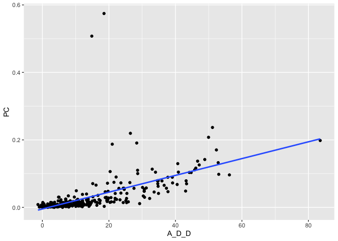

Homework 2
================
Junhan Huang
2/10/2021

# 1.Problem 1

``` r
F<-flights
```

## 1.1 How many flights have a missing dep\_time?

``` r
Missing<-F%>%filter(is.na(dep_delay))
dim(Missing)[1]
```

    ## [1] 8255

There are 8255 flights have a missing dep\_time

## 1.2 What other variables are missing?

``` r
n1<-dim(F)[2]
int1<-1:n1
list<-c()

for (i in int1) {
  
  Missing<-which(is.na(F[,i])==TRUE)
  LM<-length(Missing)
  
  if (LM!=0){
    list[i]=i
  }
  else{
   list[i]=0
 }
}

CN<-colnames(F)
CN[list]
```

    ## [1] "dep_time"  "dep_delay" "arr_time"  "arr_delay" "tailnum"   "air_time"

There are 5 variables having missing value, which are “dep\_time”,
“dep\_delay”, “arr\_time”, “arr\_delay”, “tailnum”, and “air\_time”

## 1.3 What might these rows represent?

These rows might represent the flights were canceled

# 2\. Problem 2

``` r
dpt<-as.character(F$dep_time)
scht<-as.character(F$sched_dep_time)
new_dpt<-c()
new_scht<-c()

n2<-length(dpt)
int2<-1:n2

for(i in int2){
  sp<-strsplit(dpt[i], split = "")
  sp<-sp[[1]]
  if(length(sp)==3){
    new_dpt[i]<-paste(sp[1],":",sp[2],sp[3],sep = "")
  }
  else if(length(sp)==4){
    new_dpt[i]<-paste(sp[1],sp[2],":",sp[3],sp[4],sep = "")
  }
  else{
    new_dpt[i]=NA
  }
}

for(i in int2){
  sp<-strsplit(scht[i], split = "")
  sp<-sp[[1]]
  if(length(sp)==3){
    new_scht[i]<-paste(sp[1],":",sp[2],sp[3],sep = "")
  }
  else if(length(sp)==4){
    new_scht[i]<-paste(sp[1],sp[2],":",sp[3],sp[4],sep = "")
  }
  else{
    new_scht[i]=NA
  }
}

F$dep_time<-new_dpt
F$sched_dep_time<-new_scht

write.csv(F, "New Flights.csv")
```

# 3\. Problem 3

``` r
F %>% group_by(month, day) %>%
  summarize(A_D_D= mean(dep_delay, na.rm = TRUE),
            PC= sum(is.na(dep_time)/n())) %>%
  ggplot(mapping = aes(x = A_D_D, y = PC)) +
  geom_point() +
  geom_smooth(method = 'lm', se = FALSE)
```

    ## `geom_smooth()` using formula 'y ~ x'

<!-- -->
